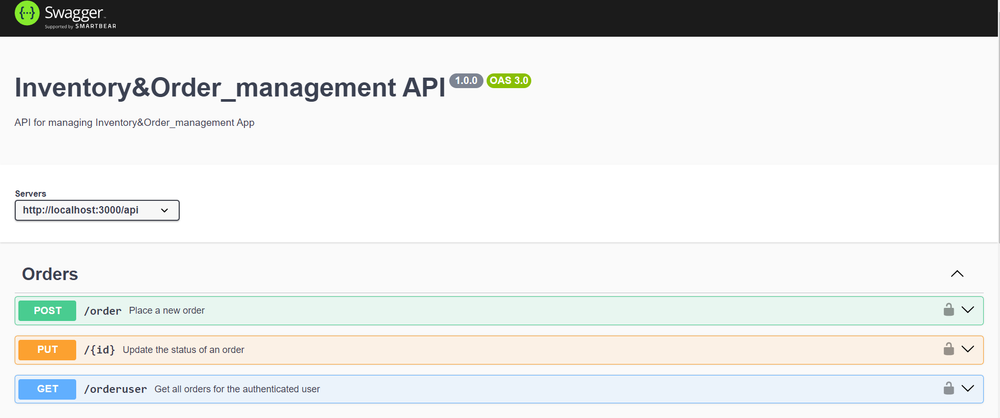
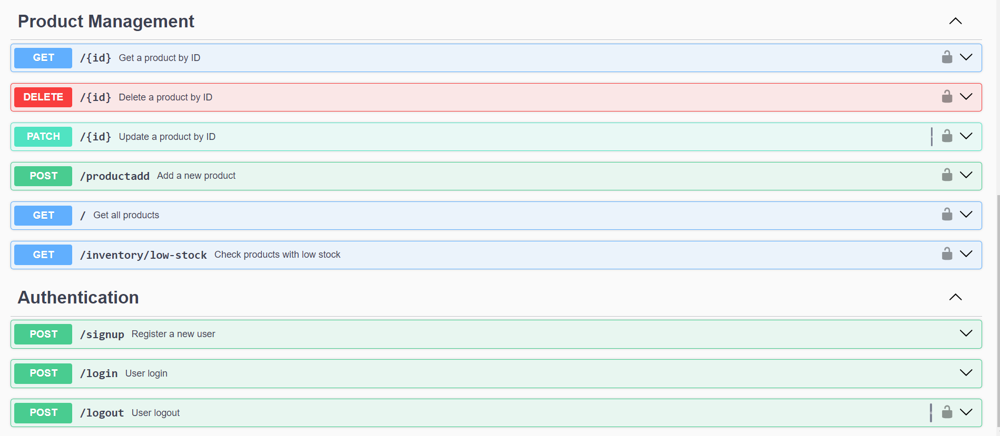

# Inventory & Order Management API

This project is an Inventory and Order Management system implemented using Node.js, Express.js, and MongoDB. It provides user authentication, role-based access control, inventory management, and order processing capabilities.

## Features

### 1. User Authentication
- JWT-based authentication for both customers and admins.
- Role-based access control:
  - **Admin:** Can manage inventory and view all orders.
  - **Customer:** Can browse products, place orders, and view their order history.

### 2. Inventory Management
- Endpoints for managing products:
  - CRUD operations for creating, viewing, updating, and deleting products.
  - Admins can manage stock levels, with alerts for low-stock products.

### 3. Order Management
- **Customers**:
  - Can place orders with multiple products.
  - Can view the status of their orders (Pending, Shipped, Delivered).
- **Admins**:
  - Can update the status of orders and view all customer orders.
  
### 4. MongoDB Collections
- Data is stored in MongoDB with collections for users, products, and orders.

## Prerequisites

- [Node.js](https://nodejs.org/) >= 14.x
- [MongoDB](https://www.mongodb.com/) (local or cloud instance)

 ## fitness Swagger UI
   
   
   <br>
   


   ## Technologies Used
- Node.js
- Express.js
- MongoDB
- JWT (JSON Web Token)


### Setup .env file

```bash
DATABASE_URL=Your_mongo_url
PORT=Sevice_port
cloud_name=Cloudinary_cloud_name
api_key=Cloudinary_api_key
api_secret=Cloudinary_api_secret
NODE_ENV=NODE_ENVIRINMENT
JWT_SECRET=jwt_secret
```

### Run this app locally

```shell
npm run build
```

### Start the app

```shell
npm start
```
